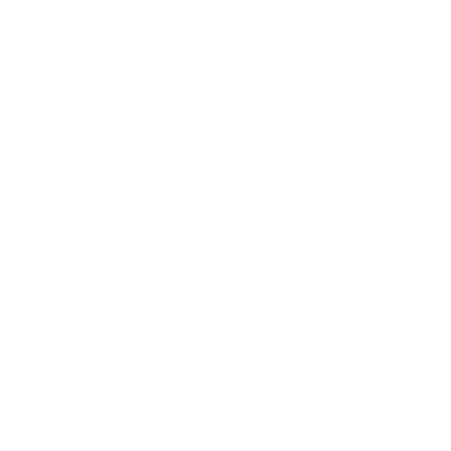

# Plateforme de Tailleur en Ligne

<div align="center">
  
  &nbsp;
  &nbsp;
  &nbsp;
  &nbsp;
  
  &nbsp;
  &nbsp;
  &nbsp;
  &nbsp;
  
  &nbsp;
  &nbsp;
  &nbsp;
  &nbsp;
  
</div>

## Description du Projet

La **Plateforme de Tailleur en Ligne** est une application web conçue pour moderniser le secteur de la couture traditionnelle marocaine. Elle permet aux tailleurs locaux de vendre leurs vêtements traditionnels directement aux consommateurs, offrant ainsi une solution pour étendre leur marché et améliorer la visibilité de leurs produits.

## Contexte du Projet

Ce projet est réalisé dans le cadre de la formation chez ENAA, comme Projet Fil Rouge. L'objectif est de démontrer une maîtrise complète des compétences acquises au cours de la formation, en développant une application fonctionnelle, sécurisée et opérationnelle.

## Cahier des Charges

### 1. Contexte et Objectifs

**Contexte :**
- Moderniser la couture traditionnelle marocaine.
- Permettre aux tailleurs locaux de vendre leurs produits en ligne.
- Augmenter la visibilité des vêtements traditionnels.

**Objectifs :**
- Concevoir une plateforme en ligne pour la vente de vêtements traditionnels marocains.
- Fournir des outils de gestion des stocks, des commandes et de personnalisation des produits.
- Offrir une expérience d'achat en ligne sécurisée et conviviale.

### 2. Fonctionnalités Clés

- **Catalogue de Produits :** 
  - Large gamme de vêtements traditionnels.
  - Descriptions détaillées et vérification de l'authenticité.
  
- **Profils de Tailleurs :**
  - Pages dédiées pour chaque tailleur.
  - Gestion des stocks et des commandes en ligne.
  
- **Système de Commande :**
  - Panier d'achat et processus de commande.
  - Personnalisation des produits (tailles, tissus, couleurs).
  
- **Support Multi-langue et Livraison :**
  - Support multilingue pour un public international.
  - Options de livraison flexibles.
  
- **Support Évaluation et Feedback :**
  - Système de notation et commentaires.
  - Feedback pour améliorer la qualité des produits et services.
  
- **Programme de Fidélité :**
  - Points de fidélité, remises, offres spéciales.
  - Notifications personnalisées pour les clients réguliers.
  
- **Visualisation en Temps Réel :**
  - Outil de visualisation 3D.
  - Option d'avatar personnalisable.

### 3. Technologies Requises

- **Frontend :** Angular
- **Backend :** Spring Boot
- **Base de données :** MySQL

### 4. Planification du Projet

- **Configuration :** Mise en place de Jira/Trello pour la gestion des tâches.
- **Conception :** Diagrammes UML et maquettes front-end.
- **Développement :** Spring Boot pour le backend et Angular pour le frontend.
- **Sécurité :** Implémentation de Spring Security.
- **Tests :** Tests unitaires avec JUnit et Mockito.
- **Qualité du Code :** Analyse statique avec SonarQube.
- **Conteneurisation :** Docker pour le déploiement.
- **Intégration Continue :** Pipelines Jenkins.

### 5. Livrables

- **Documentation du Projet :** PDF, PPT, ou Canva.
- **Planification des Tâches :** Lien vers Jira/Trello.
- **Design Final :** Lien vers Figma/Adobe XD.
- **Repository GitHub :** 
  - README
  - Diagrammes UML (classes, use case, séquence)
  - Code source

### 6. Critères de Performance

- **Qualité du Code :** Clarté, performance, et documentation.
- **Performance Fonctionnelle :** Fiabilité et conformité.
- **Convivialité de l'Utilisateur :** Accessibilité et interface utilisateur.
- **Contrôle de Version Git :** Pratiques de versionnage cohérentes.
- **Compréhension des Concepts :** Application des concepts de formation.
- **Documentation :** Clarté et précision.

## Objectifs du Projet

1. **Élargir le Marché des Tailleurs :** Offrir une plateforme de vente en ligne.
2. **Augmenter la Visibilité des Produits :** Promouvoir les vêtements traditionnels.
3. **Simplifier la Gestion des Commandes :** Outils pour gestion des stocks et commandes.
4. **Promouvoir la Couture Traditionnelle :** Améliorer la visibilité internationale.

## État Actuel du Projet

Je suis actuellement dans la phase de **Backend**. En ce moment, je travaille précisément sur le **microservices**.

## Project Structure

```plaintext
tailoring-online-services/
│
├── uml-study/  # Contains all UML-related files and diagrams
│   ├── diagrams/  # Stores all the different types of UML diagrams
│   │   ├── class-diagram/  # Directory for class diagrams
│   │   │   ├── class-diagram.png  # Image file for the class diagram
│   │   │   └── class-diagram.uml  # Source file for the class diagram (if using a tool like PlantUML)
│   │   ├── use-case-diagram/  # Directory for use-case diagrams
│   │   │   ├── use-case-diagram.png  # Image file for the use-case diagram
│   │   │   └── use-case-diagram.uml  # Source file for the use-case diagram
│   │   ├── sequence-diagram/  # Directory for sequence diagrams
│   │   │   ├── sequence-diagram.png  # Image file for the sequence diagram
│   │   │   └── sequence-diagram.uml  # Source file for the sequence diagram
│   │   └── architecture-diagram/  # Directory for architecture diagrams
│   │       ├── architecture-diagram.png  # Image file for the architecture diagram
│   │       └── architecture-diagram.uml  # Source file for the architecture diagram
│   ├── README.md  # Documentation explaining the purpose and usage of each diagram
│   └── assets/  # Stores additional assets such as logos or mockups used in the UML documentation
│       ├── logo.png  # Example logo file
│       └── [additional assets like mockups, images, etc.]
│
├── backend/  # Contains all backend microservices implemented with Spring Boot
│   ├── eureka-server/  # Service Discovery Server using Netflix Eureka
│   ├── api-gateway-service/  # API Gateway for routing requests to appropriate microservices
│   ├── user-management-service/  # Microservice for managing users (Admins, Customers, Tailors)
│   ├── product-management-service/  # Microservice for managing products (like clothing items, fabrics, etc.)
│   ├── store-management-service/  # Microservice for managing store information and operations
│   ├── order-management-service/  # Microservice for managing orders (including order tracking, status, etc.)
│   ├── payment-banking-service/  # Microservice for managing payment and banking transactions
│   ├── notification-mailing-service/  # Microservice for handling notifications and emails to users
│   ├── promotion-management-service/  # Microservice for managing promotions, discounts, and special offers
│   ├── localization-shipping-service/  # Microservice for handling localization (multi-language support) and shipping logistics
│   ├── loyalty-program-service/  # Microservice for managing loyalty programs and customer rewards
│   ├── Dockerfile  # Dockerfile for building the backend microservices
│   └── docker-compose.yml  # Docker Compose file for orchestrating and running all the backend services together
│
├── frontend/  # Contains the frontend application implemented with Angular
│   ├── angular-app/  # Main Angular project directory
│   │   ├── src/  # Source files for the Angular application
│   │   │   ├── app/  # Application modules and components
│   │   │   │   ├── core/  # Core module containing singleton services, global guards, and interceptors
│   │   │   │   ├── shared/  # Shared module for common components, directives, and pipes
│   │   │   │   ├── admin/  # Module containing components and services for the Admin dashboard
│   │   │   │   ├── customer/  # Module containing components and services for the Customer dashboard
│   │   │   │   ├── tailor/  # Module containing components and services for the Tailor dashboard
│   │   │   │   └── [other modules...]  # Other feature modules as needed
│   │   │   ├── assets/  # Static assets such as images, icons, etc.
│   │   │   │   ├── logo.png  # Example logo file
│   │   │   │   └── [additional assets...]
│   │   │   ├── environments/  # Environment-specific configuration files
│   │   │   │   ├── environment.prod.ts  # Production environment settings
│   │   │   │   └── environment.ts  # Development environment settings
│   │   │   └── [additional Angular files...]  # Additional Angular project files (modules, components, etc.)
│   │   ├── angular.json  # Angular project configuration file
│   │   └── package.json  # Node.js package file for managing project dependencies
│   ├── Dockerfile  # Dockerfile for building the Angular frontend
│   └── nginx/  # NGINX configuration for serving the Angular application in production
│       ├── nginx.conf  # NGINX configuration file
│       └── Dockerfile  # Dockerfile for building the NGINX server
│
└── README.md  # Root README file providing an overview of the entire project, including architecture, setup instructions, and more
```

## Contact

Pour toute question ou demande d'informations supplémentaires, veuillez contacter : [yassineoularbi4@gmail.com]

